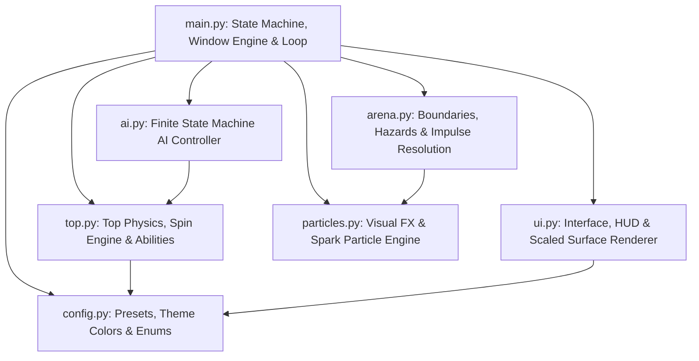
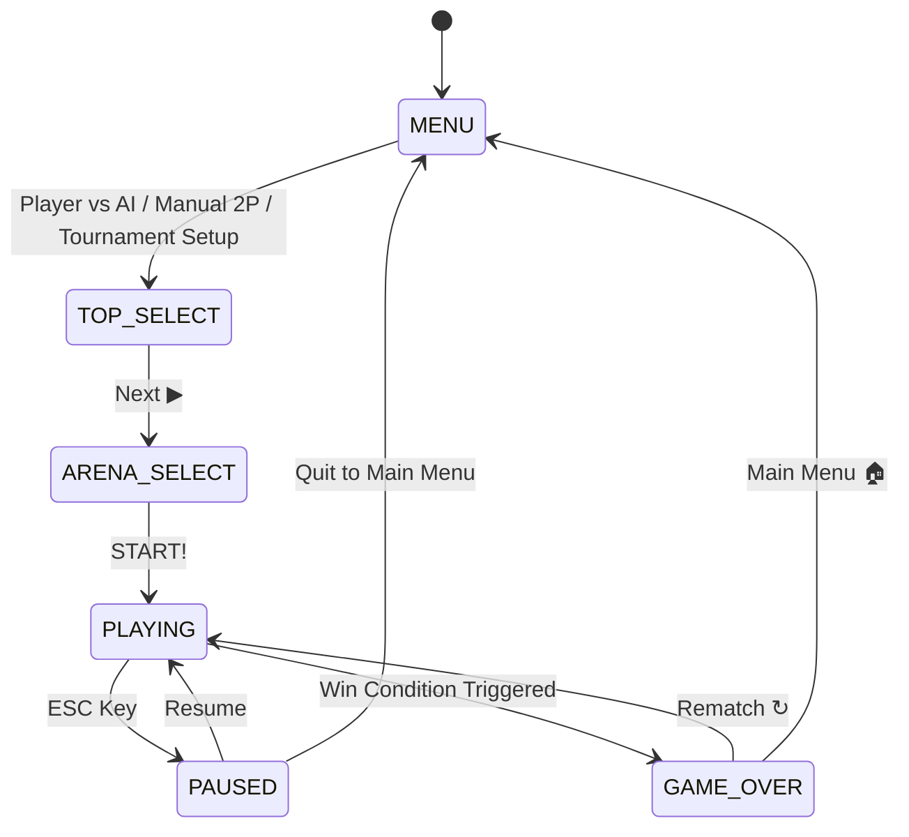
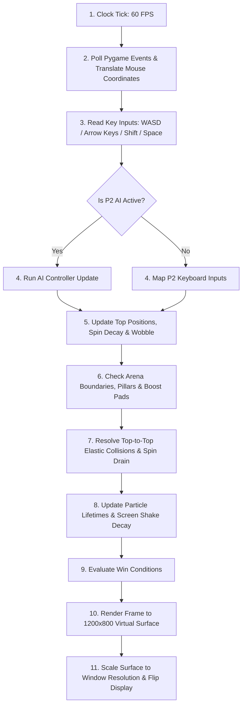
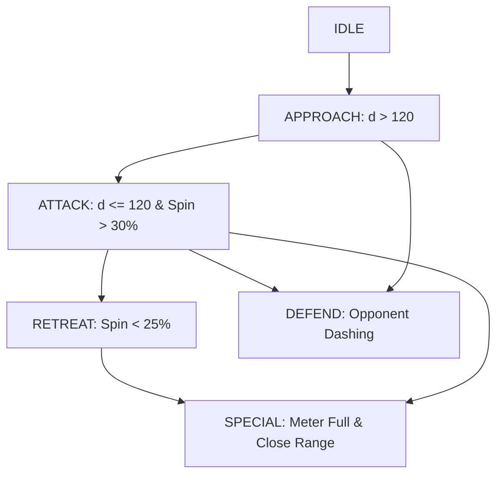
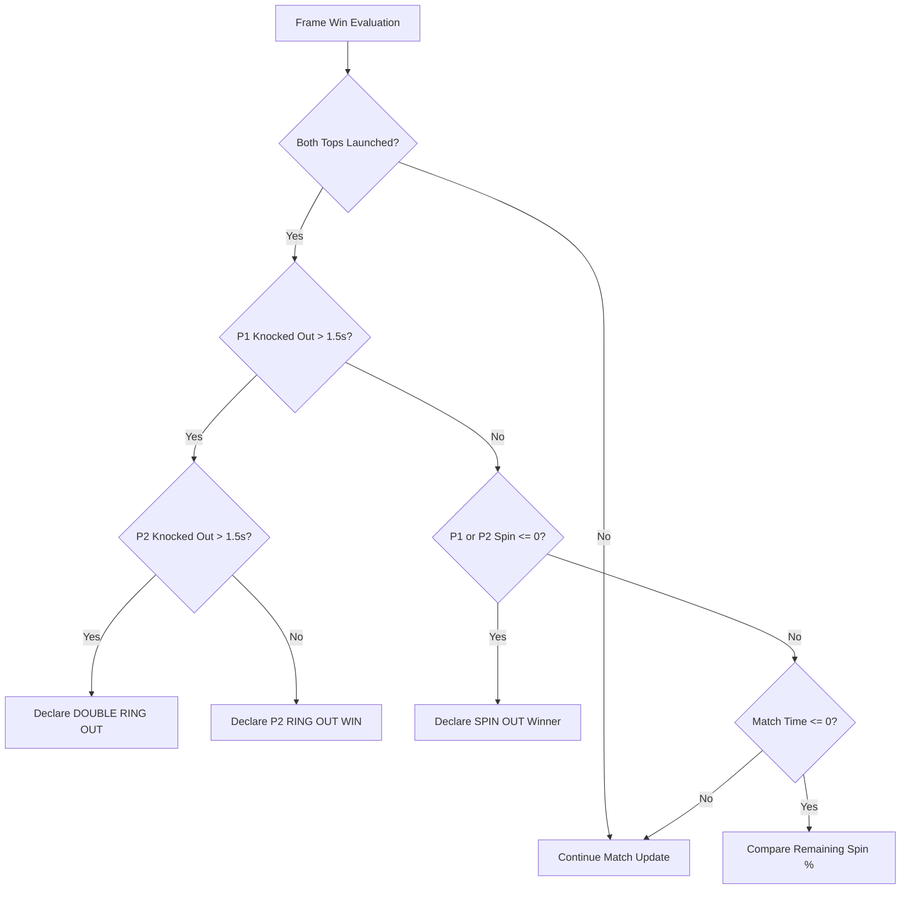

# Pambaram Game Development - Complete Logic & Architectural Specification

This document provides a complete, deep-dive specification of the entire software logic, mathematical physics models, display scaling algorithms, game state machine, artificial intelligence decision engine, and collision detection rules for **Pambaram: Spinning Top Battle Arena**.

---

## 1. System Architecture & Module Structure

The project is designed in a decoupled modular structure with Pygame serving as the rendering and event-handling backend.

### Module Responsibilities:
1. [`main.py`](file:///E:/Academics/GD/Project/sample1/main.py): Entry point, display initialization, window resizing/scaling canvas engine, game loop at 60 FPS, win condition evaluation, and high-level state dispatching.
2. [`top.py`](file:///E:/Academics/GD/Project/sample1/top.py): Individual top instance states (positions, translational velocities, angular spin speed, mass, grip, wobbling physics, dash abilities, and special moves).
3. [`arena.py`](file:///E:/Academics/GD/Project/sample1/arena.py): Arena rendering, obstacle/pillar collision detection, boost pads, circular play boundaries, wall dampening bounce physics, and top-to-top elastic momentum exchange.
4. [`ai.py`](file:///E:/Academics/GD/Project/sample1/ai.py): Autonomous AI state machine (`IDLE`, `APPROACH`, `ATTACK`, `RETREAT`, `DEFEND`, `SPECIAL`) with 3 difficulty profiles (Easy, Medium, Hard).
5. [`ui.py`](file:///E:/Academics/GD/Project/sample1/ui.py): Single-pass clean border rendering, buttons, selection cards, match HUD, launch power meters, and pause/victory modal views.
6. [`particles.py`](file:///E:/Academics/GD/Project/sample1/particles.py): High-performance particle engine emitting sparks, spin trails, dust rings, boost waves, and ring-out explosions.
7. [`config.py`](file:///E:/Academics/GD/Project/sample1/config.py): Global configuration, display constants, color theme palette, top presets, arena presets, and enums.

---

## 2. Complete State Machine & Game Lifecycle

The execution lifecycle of the game is governed by the `GameState` enum inside [`main.py`](file:///E:/Academics/GD/Project/sample1/main.py):

### Execution States Detailed:
- **`MENU`**: Main title screen. Allows selecting **Player vs AI**, **Player vs Player (Manual 2P)**, **Tournament Setup**, and **AI Difficulty** toggles.
- **`TOP_SELECT`**: Grid of top selection cards. Allows assigning Player 1 top (Left-Click) and Player 2/AI top (Right-Click), while toggling AI / 2P mode dynamically.
- **`ARENA_SELECT`**: Displays 4 selectable arena cards with distinct floor grip modifiers and hazard types.
- **`PLAYING`**: Active match state. Executes the 60 FPS update loop: input mapping $\rightarrow$ AI decisions $\rightarrow$ physics updates $\rightarrow$ boundary checks $\rightarrow$ collisions $\rightarrow$ particle FX $\rightarrow$ win checks.
- **`PAUSED`**: Pauses match updates, renders a dark overlay with Resume, Restart, and Main Menu buttons.
- **`GAME_OVER`**: Triggered when a win condition evaluates. Displays the match winner, elimination reason, elapsed match duration, final remaining spins, and dynamic score calculation.

---

## 3. Frame Update Loop & Coordinate Scaling Engine

### 3.1 60 FPS Frame Pipeline

Every frame during `GameState.PLAYING`, the engine runs the following sequence:

### 3.2 Display Scaling & Mouse Position Translation Engine

To ensure full-screen, windowed, and resizable compatibility without distorting game graphics, all drawing occurs on an internal **$1200 \times 800$ virtual canvas (`self.screen`)**, which is then scaled to the target window resolution (`self.window`).

#### Canvas Scaling Algorithm:
Given target window dimensions $(W_w, H_w)$ and base canvas dimensions $(1200, 800)$:

$$\text{scale} = \min\left(\frac{W_w}{1200}, \frac{H_w}{800}\right)$$

$$\text{Width}_{\text{scaled}} = 1200 \cdot \text{scale}, \quad \text{Height}_{\text{scaled}} = 800 \cdot \text{scale}$$

$$\text{Offset}_x = \frac{W_w - \text{Width}_{\text{scaled}}}{2}, \quad \text{Offset}_y = \frac{H_w - \text{Height}_{\text{scaled}}}{2}$$

#### Mouse Coordinate Translation Algorithm:
For any raw OS mouse event at window position $(X_m, Y_m)$, the mapped virtual coordinate $(X_v, Y_v)$ on the $1200 \times 800$ surface is calculated as:

$$X_v = \frac{X_m - \text{Offset}_x}{\text{scale}}, \quad Y_v = \frac{Y_m - \text{Offset}_y}{\text{scale}}$$

This guarantees accurate button clicks and launch drag vectors on any monitor resolution or aspect ratio.

---

## 4. Mathematical Physics Model

### 4.1 Angular Velocity & Spin Decay Engine

Every spinning top starts with initial spin energy $\Omega_0 = \Omega_{\max} \cdot f_{\text{launch}}$, where $f_{\text{launch}} \in [0.5, 1.0]$. Spin energy $\Omega$ degrades over time $t$ according to:

$$\Omega_{t+\Delta t} = \max\left(0, \Omega_t - (\delta \cdot \mu_a \cdot k_{\text{dash}}) \cdot \Delta t\right)$$

Where:
- $\delta$: Base spin decay rate defined in top preset (e.g., $150$ for Velu Vettaikaran).
- $\mu_a$: Arena floor grip modifier ($1.0$ for Village Ground, $0.65$ for slippery River Bed).
- $k_{\text{dash}}$: Dash multiplier ($2.5$ when top is dashing, $1.0$ otherwise).

### 4.2 Gyroscopic Wobble Physics

As a top's spin ratio $r_s = \frac{\Omega}{\Omega_{\max}}$ drops, gyroscopic stability decreases and wobbling increases:

$$W = \max\left(0, (1.0 - r_s) \cdot 15\right) + \begin{cases} \sin(0.02 \cdot \text{ticks}) \cdot (5 - 25 r_s) & \text{if } r_s < 0.2 \\ 0 & \text{otherwise} \end{cases}$$

### 4.3 Steering Force & Friction Acceleration

Translational movement vector $\vec{u} = (u_x, u_y)$ accelerates top velocity $\vec{v} = (v_x, v_y)$:

$$G_{\text{effective}} = G_{\text{top}} \cdot \mu_a$$

$$P_{\text{steer}} = 250 \cdot G_{\text{effective}} \cdot (0.3 + 0.7 r_s) \cdot (2.5 \text{ if dashing else } 1.0)$$

$$\vec{a}_{\text{steer}} = \frac{\vec{u} \cdot P_{\text{steer}} - 0.5 \vec{v}}{1.0 + 0.5 (1.0 - r_s)}$$

$$\vec{v}_{t+\Delta t} = \vec{v}_t + \vec{a}_{\text{steer}} \cdot \Delta t$$

Surface drag reduces speed based on grip and spin ratio:

$$\text{Drag} = 0.4 \cdot G_{\text{effective}} \cdot \Delta t \cdot \left(1 + 0.5(1 - r_s)\right)$$

$$\vec{v}_{\text{dragged}} = \vec{v} \cdot \max\left(0, 1.0 - \text{Drag}\right)$$

---

## 5. Collision & Boundary Resolution Logic

### 5.1 Elastic Top-to-Top Collision Impulse

When distance $d = |\vec{p}_2 - \vec{p}_1| < R_1 + R_2$, normal vector $\hat{n}$ and relative velocity $\vec{v}_{\text{rel}}$ are computed:

$$\hat{n} = \frac{\vec{p}_2 - \vec{p}_1}{d}, \quad \vec{v}_{\text{rel}} = \vec{v}_1 - \vec{v}_2$$

$$v_{1n} = \vec{v}_1 \cdot \hat{n}, \quad v_{2n} = \vec{v}_2 \cdot \hat{n}$$

Using coefficient of restitution $e = 0.85$, normal impulse magnitude $J$ is:

$$J = \frac{-(1 + e) \cdot (v_{1n} - v_{2n})}{\frac{1}{m_1} + \frac{1}{m_2}}$$

Post-collision velocities:

$$\vec{v}_1' = \vec{v}_1 + \frac{J}{m_1}\hat{n}, \quad \vec{v}_2' = \vec{v}_2 - \frac{J}{m_2}\hat{n}$$

Overlapping tops are separated along normal $\hat{n}$ by overlap distance $\Delta d = (R_1 + R_2 - d) / 2$.

### 5.2 Collision Impact Spin Drain

The physical impact magnitude $I = |J|$ degrades spin energy of both colliding tops:

$$\Delta \Omega_1 = \min\left(\Omega_1, \frac{I \cdot m_2}{m_1} \cdot 0.8\right)$$

$$\Delta \Omega_2 = \min\left(\Omega_2, \frac{I \cdot m_1}{m_2} \cdot 0.8\right)$$

### 5.3 Arena Boundary Dynamics

The arena is centered at $\vec{C} = (600, 450)$:
- **Play Radius** ($R \le 280\text{px}$): Standard movement.
- **Bounce Zone** ($280\text{px} < R \le 320\text{px}$): Normal velocity component is reversed with dampening factor $0.65$:

$$\vec{v}_{\text{bounce}} = \vec{v} - 1.65 (\vec{v} \cdot \hat{n}_{\text{arena}})\hat{n}_{\text{arena}}$$

- **Ring Out Zone** ($R > 320\text{px}$): Triggers `is_knocked_out = True` and initiates knockout timer ($t_{\text{ko}}$).

---

## 6. Artificial Intelligence Decision Engine (`ai.py`)

The AI controller runs a Finite State Machine (FSM) evaluating distance to opponent $d = |\vec{p}_{\text{opp}} - \vec{p}_{\text{AI}}|$, spin ratio $r_s$, and center distance $r_c = |\vec{p}_{\text{AI}} - \vec{C}|$:

### AI Difficulty Matrix:

| Feature | EASY | MEDIUM | HARD |
| :--- | :--- | :--- | :--- |
| **Decision Interval** | $0.8\text{s}$ | $0.4\text{s}$ | $0.2\text{s}$ |
| **Target Error Offset** | $\pm 40\text{px}$ | $\pm 15\text{px}$ | $0\text{px}$ (Exact) |
| **Dash Rate** | $15\%$ | $45\%$ | $80\%$ |
| **Special Ability Use** | Trigger $>90\%$ meter | Trigger $>75\%$ meter | Trigger $>60\%$ meter |

---

## 7. Win Conditions & Dynamic Score Engine

### 7.1 Double-Launch Requirement & Win Evaluation

To eliminate accidental single-launch instant wins, match evaluation strictly requires **both tops to have entered play** ($\text{is\_launched}_1 \text{ and } \text{is\_launched}_2$).

### 7.2 Dynamic Score Calculation Formula

When a match ends with a valid winner, score points ($S$) are calculated dynamically based on performance:

$$S = \begin{cases} \left\lfloor 200 + \left(\frac{\Omega_{\text{winner}}}{\Omega_{\max}} \cdot 100\right) \cdot 3 + \max(0, (180 - t_{\text{elapsed}}) \cdot 2) + B_{\text{reason}} \right\rfloor & \text{if Winner} \\ 0 & \text{if Draw} \end{cases}$$

Where elimination reason bonus $B_{\text{reason}} = 150$ for *Ring Out* and $100$ for *Spin Out*.

---

## 8. Summary of All Logic Modules

- **Rendering Engine**: Pygame surface canvas with aspect-ratio scaling and transformed mouse coordinate mapping.
- **Physics Engine**: Differential angular spin decay, gyroscopic wobbling, directional steer resistance, dynamic mass acceleration, and 2D elastic vector collision resolution.
- **AI Engine**: FSM AI controller adjusting attack, defense, retreat, and special abilities across 3 difficulty tiers.
- **UI Engine**: Single-pass clean border rounded rectangles, responsive buttons, top/arena selection cards, live HUD meters, and victory stats modal.
