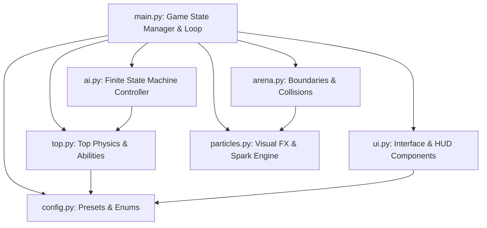
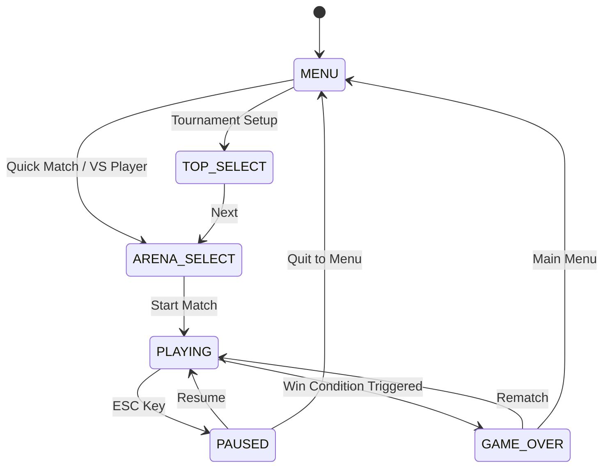
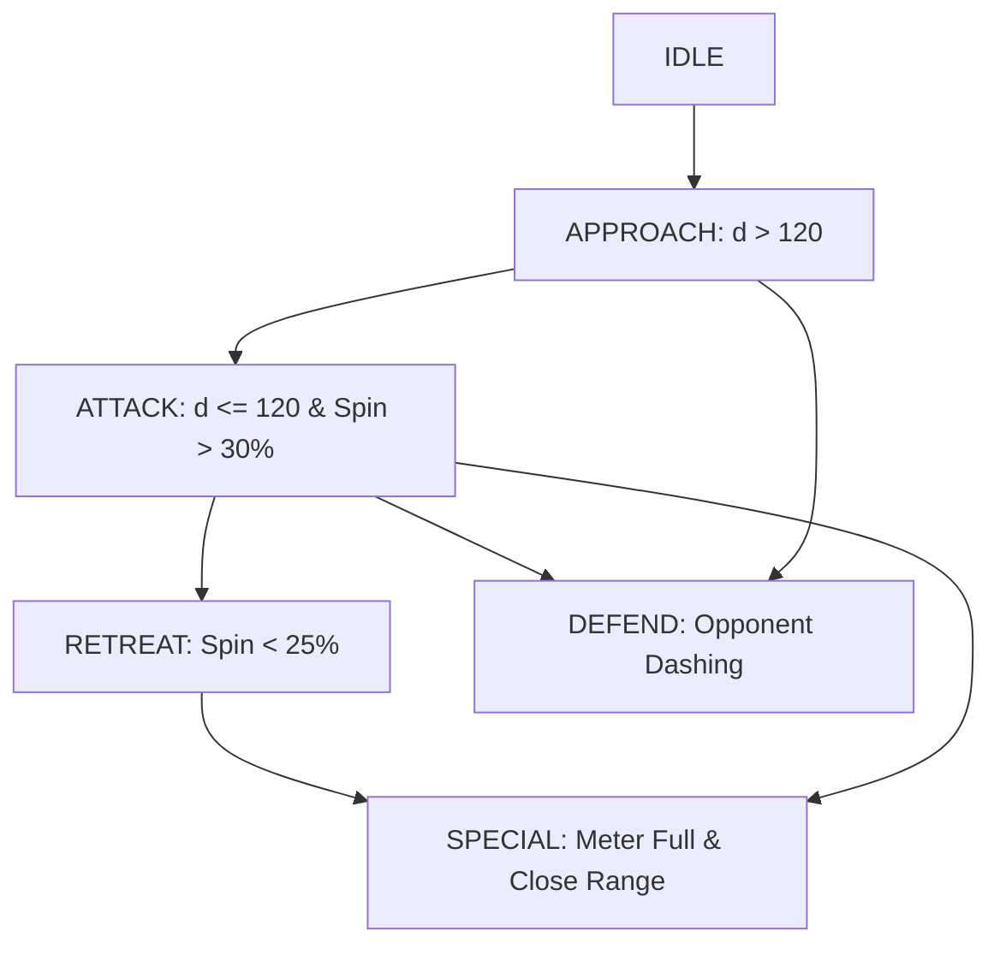
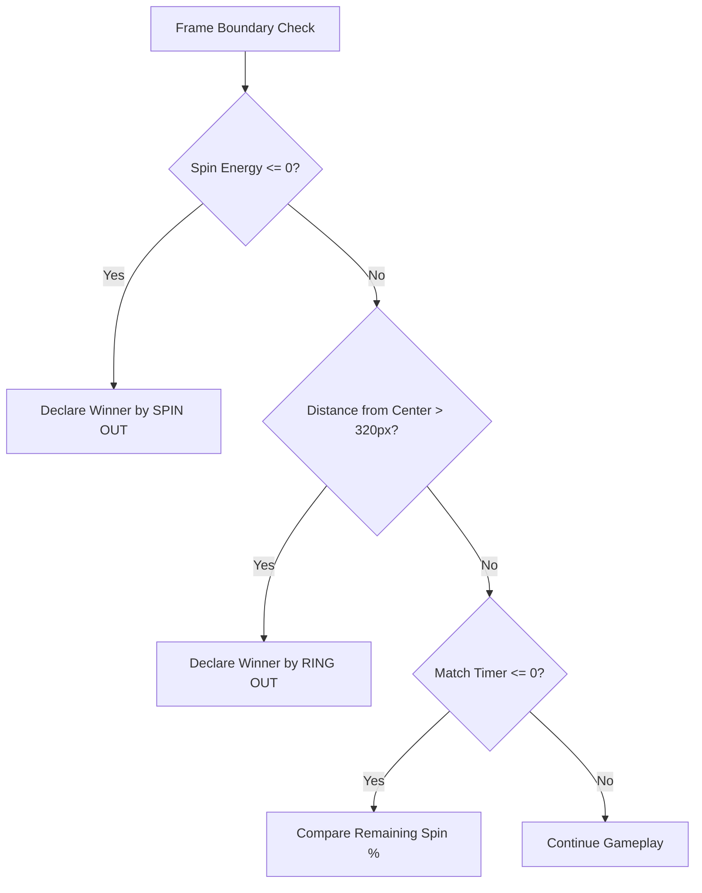

# Pambaram Game Development & Implementation Specification

This document provides a comprehensive technical breakdown of the architecture, implementation flow, mathematical physics model, state machine, AI controller, collision mechanics, and user interface logic for **Pambaram: Spinning Top Battle Arena**.

---

## 1. System Architecture Overview



---

## 2. Core Implementation Flow

### 2.1 Game Lifecycle State Machine

The top-level execution is controlled by `Game` class in [`main.py`](file:///E:/Academics/GD/Project/sample1/main.py) through an `Enum` state machine (`GameState`):



### 2.2 Frame Update Cycle (`60 FPS`)

Every frame during `GameState.PLAYING`, the loop proceeds through the following execution steps:

1. **Input Processing**: Reads mouse drag events (launch power/angle calculation), `WASD` / Arrow key steer vectors, Shift keys (Dash), and Space/Enter (Special abilities).
2. **AI Logic (`ai.py`)**: Computes directional steer vectors, dash triggers, and special activation based on top distance, remaining spin, and active state.
3. **Top Physics Update (`top.py`)**: Applies friction decay, angular velocity loss, steer forces, dash boosts, special ability cooldowns, and trail particle updates.
4. **Arena Dynamics (`arena.py`)**: Resolves top-to-top momentum exchange, arena wall bounce damping, ring-out out-of-bounds detection, pillar collisions, and neon boost pad triggers.
5. **Particle System (`particles.py`)**: Advances particle lifetimes, positions, and alpha blits.
6. **Win Condition Checks**: Validates if any top has hit $0$ spin energy or crossed the $R > 320\text{px}$ ring-out boundary, or if the match timer reached $0$.
7. **Screen Render**: Draws background layers, arena rings, obstacles, boost pads, particle trails, tops, launch indicators, HUD overlays, and active screen shake offsets.

---

## 3. Mathematical Physics & Collision Equations

### 3.1 Spin Decay Equation
Spin energy ($\Omega$) decays over time ($t$) based on base decay rate ($\delta$), grip modifier ($\mu_a$), and active steering penalty ($\sigma$):

$$\Omega_{t+\Delta t} = \max\left(0, \Omega_t - (\delta \cdot \mu_a + \sigma) \cdot \Delta t\right)$$

Where steering penalty $\sigma = 15.0$ when actively steering, and $0$ otherwise.

### 3.2 Dynamic Mass & Gyroscopic Steering

Translational acceleration $(\vec{a})$ derived from steer input vector $(\vec{u})$ is scaled by spin ratio $r_s = \frac{\Omega}{\Omega_{\max}}$ and top grip $(G)$:

$$\vec{a}_{\text{steer}} = \vec{u} \cdot \left(\frac{180 \cdot G \cdot \mu_a \cdot (0.3 + 0.7 r_s)}{m}\right)$$

### 3.3 Elastic Collision & Momentum Transfer

When two tops collide ($|\vec{p}_2 - \vec{p}_1| < R_1 + R_2$), normal vector $\hat{n}$ and tangent vector $\hat{t}$ are derived:

$$\hat{n} = \frac{\vec{p}_2 - \vec{p}_1}{|\vec{p}_2 - \vec{p}_1|}, \quad \hat{t} = \begin{pmatrix} -\hat{n}_y \\ \hat{n}_x \end{pmatrix}$$

Velocities are projected into normal components $v_{1n}, v_{2n}$. The relative normal velocity is:

$$v_{\text{rel}} = v_{1n} - v_{2n}$$

Using coefficient of restitution $e = 0.85$, the impulse magnitude $J$ is calculated using effective masses $m_1, m_2$:

$$J = \frac{-(1 + e) \cdot v_{\text{rel}}}{\frac{1}{m_1} + \frac{1}{m_2}}$$

Post-collision velocities:

$$\vec{v}_1' = \vec{v}_1 - \frac{J}{m_1}\hat{n}, \quad \vec{v}_2' = \vec{v}_2 + \frac{J}{m_2}\hat{n}$$

### 3.4 Spin Friction Loss from Collision Impact

Impact magnitude $I = |J|$ degrades spin energy of both tops proportionally to collision intensity and opponent mass ratio:

$$\Delta \Omega_1 = \min\left(\Omega_1, \frac{I \cdot m_2}{m_1} \cdot 0.8\right)$$

$$\Delta \Omega_2 = \min\left(\Omega_2, \frac{I \cdot m_1}{m_2} \cdot 0.8\right)$$

---

## 4. Playable Characters & Arenas Specification

### 4.1 Top Presets (`TOP_PRESETS`)

| Name | Type | Mass ($m$) | Max Spin | Spin Decay | Grip | Special Ability | Description |
| :--- | :--- | :--- | :--- | :--- | :--- | :--- | :--- |
| **Velu Vettaikaran** | Attack | 3.5 | 1800 | 90 | 1.2 | **Ram Strike** | Speed dash + Invincibility + Boosted Mass |
| **Veerapandiya** | Attack | 3.2 | 1950 | 95 | 1.1 | **Ram Strike** | Aggressive, heavy collision strike |
| **Kottai Veeran** | Defense | 4.5 | 1400 | 50 | 1.5 | **Iron Wall** | Mass doubled ($2\times$) + Invincibility |
| **Kallazhagar** | Defense | 4.8 | 1350 | 45 | 1.6 | **Iron Wall** | Immovable defense top |
| **Thiruvalluvar** | Balance | 2.5 | 1700 | 70 | 1.3 | **Spin Boost** | Restores $+40\%$ max spin instantly |
| **Maruthuvar** | Balance | 2.7 | 1650 | 65 | 1.35 | **Spin Boost** | All-rounder, steady stability |
| **Puyal Kaalai** | Speed | 1.8 | 2200 | 110 | 1.0 | **Whirlwind** | Pulls opponent top toward self |
| **Sooravali** | Speed | 1.6 | 2350 | 120 | 0.95 | **Whirlwind** | Blazing speed, highly responsive steer |

### 4.2 Arena Presets (`ARENA_PRESETS`)

| Arena Name | English Name | Floor Grip Mod ($\mu_a$) | Special Feature / Hazard |
| :--- | :--- | :--- | :--- |
| **Gramam Thidal** | Village Ground | 1.0 | Flat clay surface — standard physics |
| **Kovil Prangaram** | Temple Courtyard | 1.1 | 4 Stone pillars acting as rigid bounce obstacles |
| **Aaru Paarai** | River Bed | 0.65 | Low friction sand — sliding physics & reduced steer |
| **Neon Arangam** | Neon Arena | 1.0 | 4 Cyber boost pads giving velocity + spin refills |

---

## 5. AI Controller State Machine (`ai.py`)

The AI evaluates opponent distance $d = |\vec{p}_{\text{opponent}} - \vec{p}_{\text{AI}}|$ and arena radius $r = |\vec{p}_{\text{AI}} - \vec{C}|$ to transition between 6 states:



### AI Difficulty Tiers:
* **EASY**: Reaction delay $= 0.35\text{s}$, low dash rate ($15\%$), random target offsets ($\pm 40\text{px}$).
* **MEDIUM**: Reaction delay $= 0.18\text{s}$, moderate dash rate ($45\%$), accurate trajectory tracking.
* **HARD**: Reaction delay $= 0.05\text{s}$, high dash rate ($80\%$), instant special activation upon condition match.

---

## 6. Win Conditions & Boundary Logic

Arena geometry centered at $\vec{C} = (600, 450)$:
* **Play Radius**: $R_{\text{play}} = 280\text{px}$
* **Bounce Zone**: $280\text{px} < R \le 320\text{px}$ (Applies wall bounce dampening with $0.65\times$ speed reduction).
* **Ring Out Zone**: $R > 320\text{px}$ (Triggers instant Ring Out elimination).



---

## 7. Development & Verification Standard

The implementation logic was validated across unit, integration, physics engine, and headless UI rendering test suites:

- **Physics & Collision Suite**: [`test_logic.py`](file:///E:/Academics/GD/Project/sample1/test_logic.py)
- **UI & Mouse Event Suite**: [`test_ui.py`](file:///E:/Academics/GD/Project/sample1/test_ui.py)
- **End-to-End Game Manager Suite**: [`test_integration.py`](file:///E:/Academics/GD/Project/sample1/test_integration.py)

To verify the game engine locally:
```bash
python -m unittest discover
```
