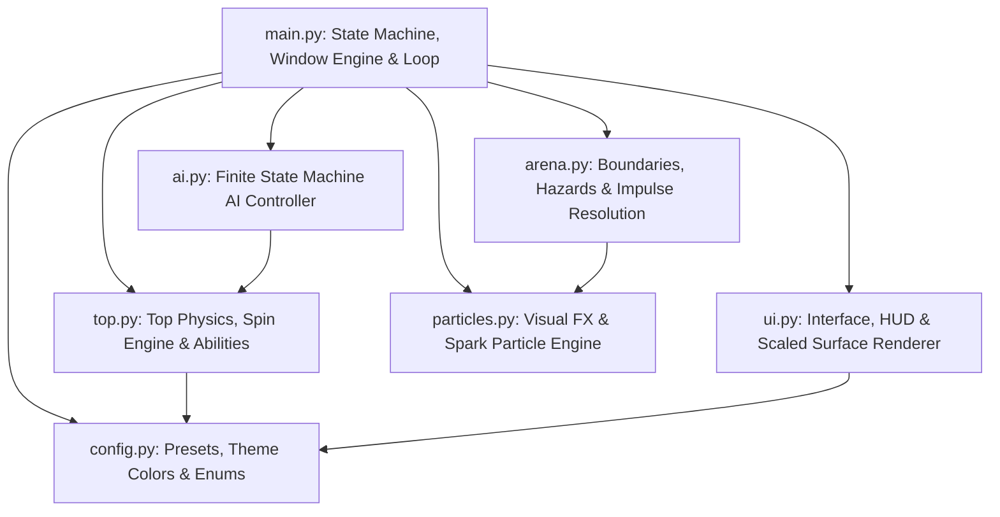
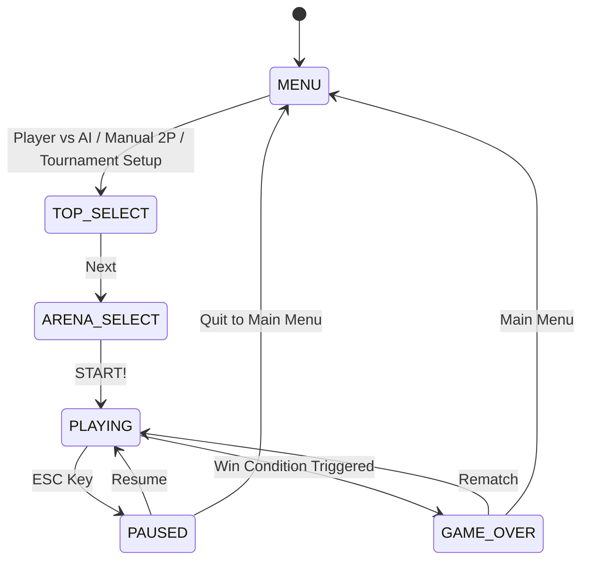
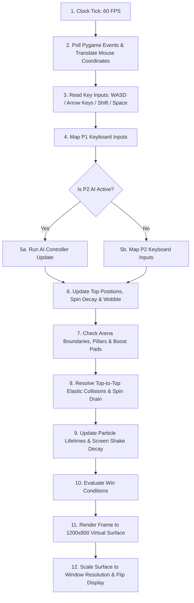
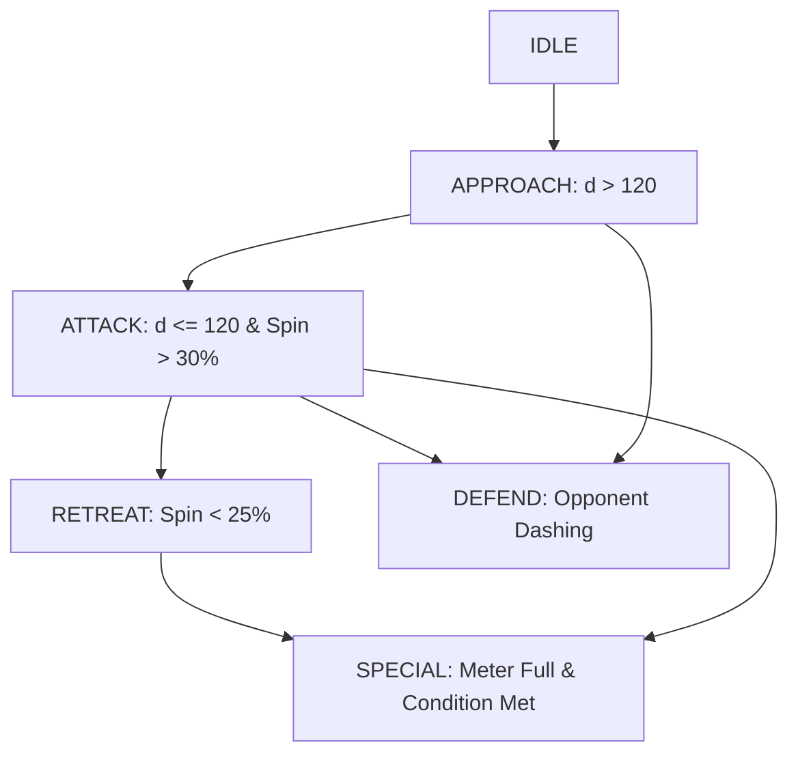
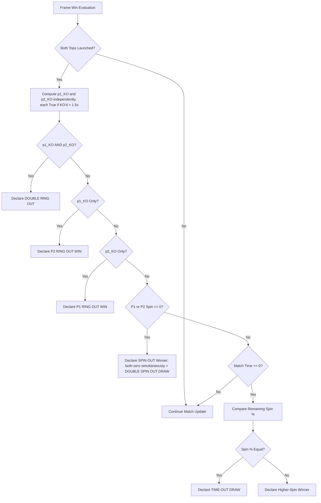

# Pambaram Game Development — Corrected Logic & Architectural Specification (v2)

This is a revision of the original specification for **Pambaram: Spinning Top Battle Arena**. The architecture, state machine, display scaling, and core collision math were already correct and are carried over unchanged. This version fixes eight concrete logic gaps found in the original — see the changelog below, then the full corrected spec.

---

## 0. Revision Notes (v1 → v2)

| # | Section | Issue | Fix |
| :-- | :-- | :-- | :-- |
| 1 | 5.3 Bounce Zone | Reflection applied unconditionally, even when the top is already moving back toward the center — flings it back out instead of letting it recover | Gate the reflection on `v⃗ · n̂ > 0` (only reflect outward-moving tops) |
| 2 | 5.3 Ring Out | No rule for a top that drifts back inside R ≤ 320 before the 1.5s knockout timer completes | Explicit recovery: cancel `is_knocked_out` and reset `t_ko` if R drops back below 320 |
| 3 | 4.3 Steering/Drag | Velocity is damped twice per frame — once via `-0.5v⃗` inside the steering acceleration, again via the separate multiplicative `Drag` pass — compounding into over-damped control at low spin | Steering acceleration is now pure force response; a single `Drag` pass handles all velocity attenuation |
| 4 | 7.1 Win Flowchart | `KO2` check nested inside `KO1 == Yes`, so a P2-only knockout is never evaluated — P1 can fail to win a match it should win | Independent `p1_KO` / `p2_KO` evaluation, then branch on the combination |
| 5 | 7.1 Win Flowchart | No tie-break defined for an exact spin-percentage tie at time-out | Added explicit `TIE-OUT DRAW` branch |
| 6 | 5.1 Collision Separation | Overlap is split 50/50 regardless of mass, inconsistent with the mass-weighted impulse | Separation now weighted by inverse mass, matching the impulse resolution |
| 7 | 6. AI FSM Diagram | `Special` node redefined with two different labels on two edges — invalid Mermaid | Declare `Special` once, reference plainly on the second edge |
| 8 | 3.1 Frame Pipeline | P1's input mapping step is implicit (folded into "Physics"), while P2's is explicit | Added an explicit P1 mapping step, symmetric with P2's |

---

## 1. System Architecture & Module Structure

Unchanged from v1 — the decoupled modular structure is sound.

### Module Responsibilities:
1. `main.py`: Entry point, display initialization, window resizing/scaling canvas engine, game loop at 60 FPS, win condition evaluation, and high-level state dispatching.
2. `top.py`: Individual top instance states (positions, translational velocities, angular spin speed, mass, grip, wobbling physics, dash abilities, and special moves).
3. `arena.py`: Arena rendering, obstacle/pillar collision detection, boost pads, circular play boundaries, wall dampening bounce physics, and top-to-top elastic momentum exchange.
4. `ai.py`: Autonomous AI state machine (`IDLE`, `APPROACH`, `ATTACK`, `RETREAT`, `DEFEND`, `SPECIAL`) with 3 difficulty profiles.
5. `ui.py`: Border rendering, buttons, selection cards, match HUD, launch power meters, and pause/victory modal views.
6. `particles.py`: Particle engine emitting sparks, spin trails, dust rings, boost waves, and ring-out explosions.
7. `config.py`: Global configuration, display constants, color theme palette, top presets, arena presets, and enums.

---

## 2. Complete State Machine & Game Lifecycle

Unchanged from v1.

- **`MENU`**: Main title screen — Player vs AI, Player vs Player, Tournament Setup, AI Difficulty toggles.
- **`TOP_SELECT`**: Grid of top selection cards; assign P1 (left-click) and P2/AI (right-click), toggle AI/2P mode.
- **`ARENA_SELECT`**: 4 selectable arena cards with distinct floor grip modifiers and hazard types.
- **`PLAYING`**: Active match — 60 FPS update loop per section 3.1 below.
- **`PAUSED`**: Pauses updates, overlay with Resume / Restart / Main Menu.
- **`GAME_OVER`**: Winner, elimination reason, match duration, final spins, dynamic score.

---

## 3. Frame Update Loop & Coordinate Scaling Engine

### 3.1 60 FPS Frame Pipeline (corrected — fix #8)

P1's input mapping is now an explicit step, symmetric with P2's AI-or-manual branch:

### 3.2 Display Scaling & Mouse Position Translation Engine

Unchanged — this math was already correct.

Given target window dimensions $(W_w, H_w)$ and base canvas dimensions $(1200, 800)$:

$$\text{scale} = \min\left(\frac{W_w}{1200}, \frac{H_w}{800}\right)$$

$$\text{Width}_{\text{scaled}} = 1200 \cdot \text{scale}, \quad \text{Height}_{\text{scaled}} = 800 \cdot \text{scale}$$

$$\text{Offset}_x = \frac{W_w - \text{Width}_{\text{scaled}}}{2}, \quad \text{Offset}_y = \frac{H_w - \text{Height}_{\text{scaled}}}{2}$$

For any raw OS mouse event at window position $(X_m, Y_m)$, the mapped virtual coordinate:

$$X_v = \frac{X_m - \text{Offset}_x}{\text{scale}}, \quad Y_v = \frac{Y_m - \text{Offset}_y}{\text{scale}}$$

---

## 4. Mathematical Physics Model

### 4.1 Angular Velocity & Spin Decay Engine

Unchanged — dimensionally correct.

$$\Omega_{t+\Delta t} = \max\left(0, \Omega_t - (\delta \cdot \mu_a \cdot k_{\text{dash}}) \cdot \Delta t\right)$$

- $\delta$: Base spin decay rate from top preset.
- $\mu_a$: Arena floor grip modifier ($1.0$ Village Ground, $0.65$ River Bed).
- $k_{\text{dash}}$: Dash multiplier ($2.5$ dashing, $1.0$ otherwise).

### 4.2 Gyroscopic Wobble Physics

Unchanged — verified continuous at the $r_s = 0.2$ boundary (the sine coefficient $(5 - 25r_s)$ hits exactly zero there, so there's no discontinuity) and always non-negative across the full $r_s$ range. No fix needed.

$$W = \max\left(0, (1.0 - r_s) \cdot 15\right) + \begin{cases} \sin(0.02 \cdot \text{ticks}) \cdot (5 - 25 r_s) & \text{if } r_s < 0.2 \\ 0 & \text{otherwise} \end{cases}$$

### 4.3 Steering Force & Friction Acceleration (corrected — fix #3)

Steering acceleration is now a pure force response — the previous embedded `-0.5v⃗` damping term is removed:

$$G_{\text{effective}} = G_{\text{top}} \cdot \mu_a$$

$$P_{\text{steer}} = 250 \cdot G_{\text{effective}} \cdot (0.3 + 0.7 r_s) \cdot (2.5 \text{ if dashing else } 1.0)$$

$$\vec{a}_{\text{steer}} = \frac{\vec{u} \cdot P_{\text{steer}}}{1.0 + 0.5 (1.0 - r_s)}$$

$$\vec{v}_{\text{integrated}} = \vec{v}_t + \vec{a}_{\text{steer}} \cdot \Delta t$$

All velocity attenuation now happens in a single subsequent drag pass — surface drag scales with grip and inversely with spin ratio (low-spin tops feel looser and slower to respond):

$$\text{Drag} = 0.4 \cdot G_{\text{effective}} \cdot \Delta t \cdot \left(1 + 0.5(1 - r_s)\right)$$

$$\vec{v}_{t+\Delta t} = \vec{v}_{\text{integrated}} \cdot \max\left(0, 1.0 - \text{Drag}\right)$$

This removes the compounding-damping bug from v1, where two independent attenuation terms both peaked at low spin ratio and made low-spin steering feel unresponsive rather than loose.

---

## 5. Collision & Boundary Resolution Logic

### 5.1 Elastic Top-to-Top Collision Impulse (corrected — fix #6)

Impulse resolution is unchanged and correct. When $d = |\vec{p}_2 - \vec{p}_1| < R_1 + R_2$:

$$\hat{n} = \frac{\vec{p}_2 - \vec{p}_1}{d}, \quad \vec{v}_{\text{rel}} = \vec{v}_1 - \vec{v}_2$$

$$v_{1n} = \vec{v}_1 \cdot \hat{n}, \quad v_{2n} = \vec{v}_2 \cdot \hat{n}$$

With coefficient of restitution $e = 0.85$:

$$J = \frac{-(1 + e) \cdot (v_{1n} - v_{2n})}{\frac{1}{m_1} + \frac{1}{m_2}}$$

$$\vec{v}_1' = \vec{v}_1 + \frac{J}{m_1}\hat{n}, \quad \vec{v}_2' = \vec{v}_2 - \frac{J}{m_2}\hat{n}$$

**Fixed:** overlap separation is now mass-weighted, consistent with the impulse math above, instead of split 50/50:

$$\Delta d_1 = (R_1 + R_2 - d) \cdot \frac{m_2}{m_1 + m_2}, \quad \Delta d_2 = (R_1 + R_2 - d) \cdot \frac{m_1}{m_1 + m_2}$$

Top 1 is displaced by $\Delta d_1$ along $-\hat{n}$; top 2 by $\Delta d_2$ along $+\hat{n}$. A heavier top now displaces less than a lighter one on impact, matching how it already absorbs less impulse.

### 5.2 Collision Impact Spin Drain

Unchanged. With $I = |J|$:

$$\Delta \Omega_1 = \min\left(\Omega_1, \frac{I \cdot m_2}{m_1} \cdot 0.8\right), \quad \Delta \Omega_2 = \min\left(\Omega_2, \frac{I \cdot m_1}{m_2} \cdot 0.8\right)$$

### 5.3 Arena Boundary Dynamics (corrected — fixes #1, #2)

Arena centered at $\vec{C} = (600, 450)$:

- **Play Radius** ($R \le 280\text{px}$): Standard movement, no correction.

- **Bounce Zone** ($280\text{px} < R \le 320\text{px}$): Reflection is now **gated on direction** — only apply to a top actually moving outward. A top drifting back toward center in this band is left alone:

$$\text{if } \vec{v} \cdot \hat{n}_{\text{arena}} > 0:\quad \vec{v}_{\text{bounce}} = \vec{v} - 1.65 (\vec{v} \cdot \hat{n}_{\text{arena}})\hat{n}_{\text{arena}}$$
$$\text{else: } \vec{v} \text{ is left unchanged}$$

  Without this gate, the unconditional v1 formula would flip an already-recovering top's inward velocity back outward, since $-1.65 \cdot (\text{negative}) = \text{positive}$.

- **Ring Out Zone** ($R > 320\text{px}$): Triggers `is_knocked_out = True` and starts/continues knockout timer $t_{\text{ko}}$ **only while the top remains in this zone**. If $R$ drops back to $\le 320\text{px}$ before $t_{\text{ko}}$ reaches $1.5\text{s}$ (e.g., pulled back by a collision or dash), `is_knocked_out` is cancelled and $t_{\text{ko}}$ resets to $0$. Without this recovery rule, a top that briefly clips the ring-out boundary and bounces back is incorrectly locked into a permanent knockout state.

---

## 6. Artificial Intelligence Decision Engine (`ai.py`)

FSM logic is unchanged and sound; only the diagram source had a bug (fix #7 — `Special` was redefined with two different labels on two edges, which is invalid Mermaid).

### AI Difficulty Matrix (unchanged):

| Feature | EASY | MEDIUM | HARD |
| :--- | :--- | :--- | :--- |
| **Decision Interval** | $0.8\text{s}$ | $0.4\text{s}$ | $0.2\text{s}$ |
| **Target Error Offset** | $\pm 40\text{px}$ | $\pm 15\text{px}$ | $0\text{px}$ (Exact) |
| **Dash Rate** | $15\%$ | $45\%$ | $80\%$ |
| **Special Ability Use** | Trigger $>90\%$ meter | Trigger $>75\%$ meter | Trigger $>60\%$ meter |

---

## 7. Win Conditions & Dynamic Score Engine

### 7.1 Double-Launch Requirement & Win Evaluation (corrected — fixes #4, #5)

Both tops must have launched before any win can trigger. **P1 and P2's knockout status are now evaluated independently** rather than nesting P2's check inside P1's branch — the v1 flowchart could never award P1 a win from a P2-only knockout. A tie-break is also added for an exact spin-percentage draw at time-out.

### 7.2 Dynamic Score Calculation Formula

Unchanged:

$$S = \begin{cases} \left\lfloor 200 + \left(\frac{\Omega_{\text{winner}}}{\Omega_{\max}} \cdot 100\right) \cdot 3 + \max(0, (180 - t_{\text{elapsed}}) \cdot 2) + B_{\text{reason}} \right\rfloor & \text{if Winner} \\ 0 & \text{if Draw} \end{cases}$$

$B_{\text{reason}} = 150$ for *Ring Out*, $100$ for *Spin Out*. All draw types (double ring-out, double spin-out, time-out tie) score $0$ for both players, consistent with the existing rule.

---

## 8. Summary of All Logic Modules

- **Rendering Engine**: Pygame surface canvas with aspect-ratio scaling and transformed mouse coordinate mapping.
- **Physics Engine**: Differential angular spin decay, gyroscopic wobbling, single-pass steering + drag resolution, mass-weighted 2D elastic collision resolution.
- **AI Engine**: FSM AI controller adjusting attack, defense, retreat, and special abilities across 3 difficulty tiers.
- **Win Engine**: Symmetric, independent per-player knockout evaluation with explicit draw handling for ring-out, spin-out, and time-out cases.
- **UI Engine**: Border rendering, responsive buttons, selection cards, live HUD meters, and victory stats modal.
