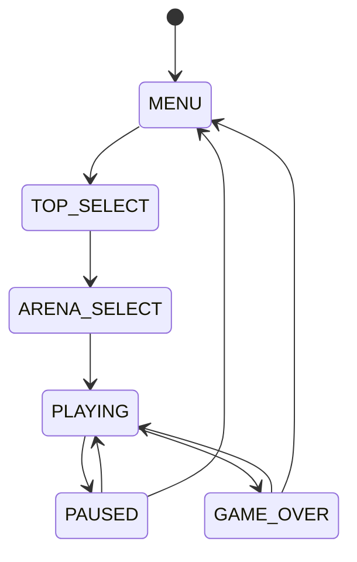
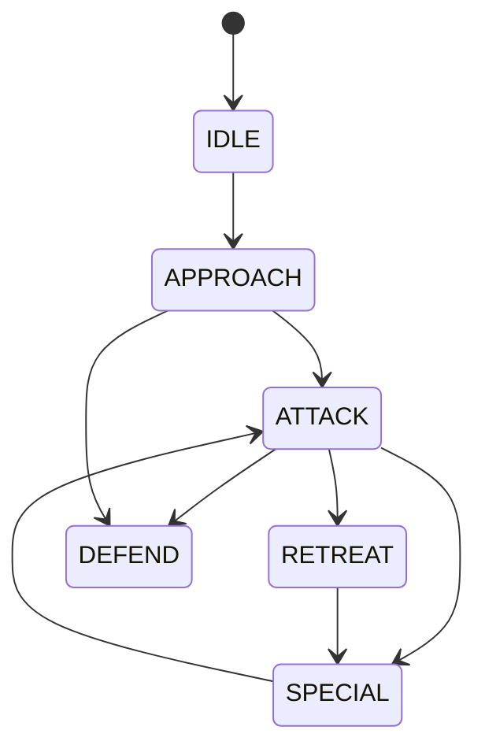
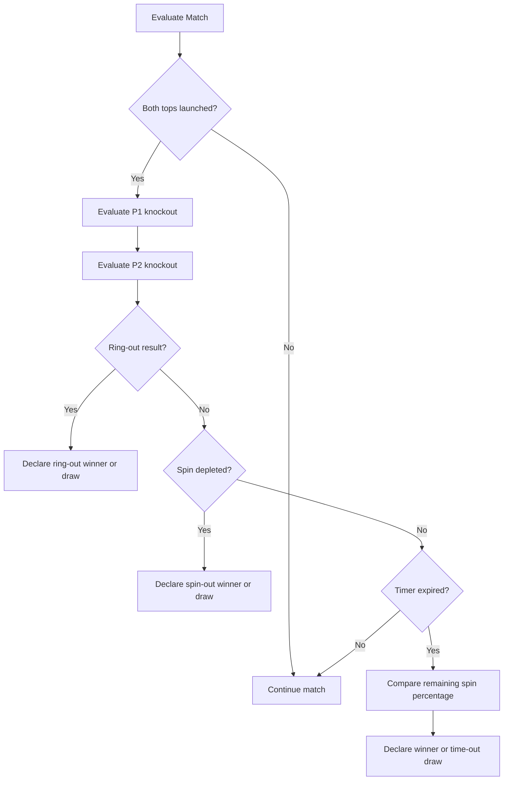
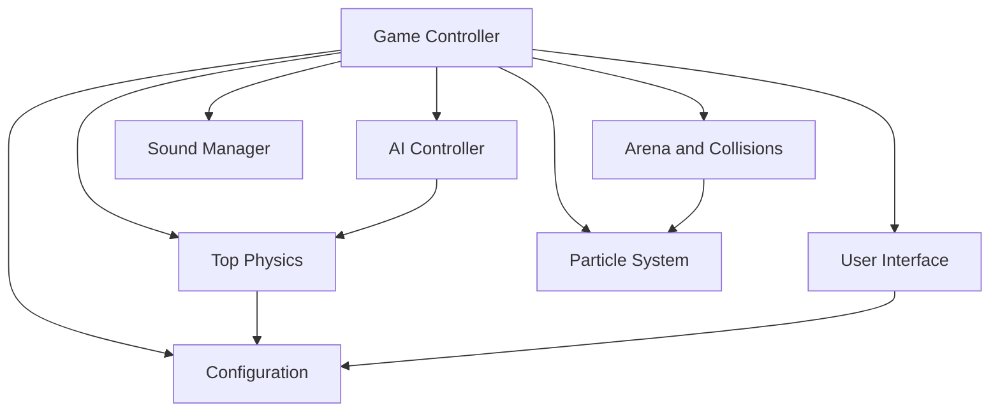

# Pambaram: Spinning Top Battle Arena

## 1. Project Overview

**Pambaram: Spinning Top Battle Arena** is a real-time physics-based arcade battle game inspired by the traditional Tamil spinning top, known as **pambaram**. Players launch and control spinning tops inside a circular arena. They use movement, momentum, collisions, dashes, and special abilities to defeat an opponent.

The game combines:

- Traditional Indian game inspiration.
- Real-time 2D physics simulation.
- Spin-energy management.
- Character-style top selection.
- Arena hazards and surface effects.
- Finite-state-machine artificial intelligence.
- Visual particle effects and procedural sound.
- A menu-driven match workflow.

The current implementation is built with **Python and Pygame**. The code is organized into independent modules so that the same game rules can later be ported to HTML Canvas, JavaScript, Unity, or Godot.

## 2. Project Objective

The objective is to create an interactive spinning-top battle game that is easy to understand but provides strategic depth through physics and top customization.

The player must decide when to:

- Launch with maximum force or conserve control.
- Chase or avoid the opponent.
- Use the arena boundary to bounce back into the ring.
- Spend spin energy on dashes.
- Activate a special ability.
- Attack an opponent with lower spin energy.
- Retreat before being pushed out of the arena.

## 3. Core Gameplay Idea

Each match contains two spinning tops:

- Player 1 controls the first top.
- Player 2 or the AI controls the second top.
- Both tops begin on opposite sides of the arena.
- A top is launched using a drag-and-release action.
- Once launched, the top moves continuously while its spin energy decreases.
- The tops collide, transfer momentum, lose spin, and generate visual effects.
- The match ends through ring-out, spin-out, or time-out.

### Core Gameplay Loop

```text
Select Mode
    -> Select Tops
    -> Select Arena
    -> Countdown
    -> Launch Tops
    -> Steer and Dash
    -> Collide and Drain Spin
    -> Use Special Abilities
    -> Check Win Condition
    -> Display Match Result
    -> Rematch or Return to Menu
```

## 4. Game Modes

### 4.1 Player vs AI

Player 1 controls one top while the computer controls the second top. The AI uses a finite-state machine and supports three difficulty levels:

- **Easy**: Slow decisions, greater aim variation, less aggressive behavior.
- **Medium**: Balanced targeting, prediction, retreat, and special usage.
- **Hard**: Frequent decisions, better prediction, faster attacks, and more reliable dash usage.

### 4.2 Player vs Player

Two players use the same keyboard and mouse:

- Player 1 uses left-click launching and WASD controls.
- Player 2 uses right-click launching and arrow-key controls.

The project also supports a manual sequential duel flow in which players take turns using their tops and their spin duration is compared.

### 4.3 Tournament Setup

The tournament setup workflow allows the player to select:

1. Player 1 top.
2. Player 2 or AI top.
3. AI difficulty.
4. Arena.
5. Match start.

Future versions may extend this into a bracket-based tournament with progression and unlocks.

## 5. Match States

The game is controlled by a state machine:



### MENU

The main menu provides:

- Player versus AI.
- Player versus player.
- Tournament setup.
- AI difficulty selection.
- Exit option.

### TOP_SELECT

The player selects available tops and assigns them to Player 1 and Player 2 or the AI.

### ARENA_SELECT

The player selects an arena with a particular visual theme, grip modifier, and hazard configuration.

### PLAYING

The active match runs at approximately 60 frames per second. Input, AI, physics, collisions, particles, sound, HUD, and win conditions are updated during this state.

### PAUSED

The game loop is visually preserved while gameplay updates stop. The player can resume, restart, or return to the main menu.

### GAME_OVER

The game displays the winner, reason for victory, remaining spin, elapsed time, and score.

## 6. Top System

Each top has a unique name, type, mass, maximum spin, spin-decay rate, grip, color, accent color, radius, and special ability.

### 6.1 Top Types

#### Attack Type

Attack tops focus on collision strength and aggressive movement.

- High collision pressure.
- Strong knockback potential.
- Faster spin consumption.
- Special ability: Ram Strike.

#### Defense Type

Defense tops are heavy and resistant to knockback.

- High mass.
- Strong stability.
- Lower movement responsiveness.
- Special ability: Iron Wall.

#### Balance Type

Balance tops provide reliable performance in all situations.

- Moderate mass.
- Moderate grip.
- Reliable spin retention.
- Special ability: Spin Boost.

#### Speed Type

Speed tops rely on movement and fast directional changes.

- Low mass.
- High movement speed.
- More difficult to control.
- Special ability: Whirlwind.

### 6.2 Available Tops

| Top | Type | Main Characteristic | Special Ability |
|---|---|---|---|
| Velu Vettaikaran | Attack | High mass and strong collision damage | Ram Strike |
| Veerapandiya | Attack | Aggressive and powerful strikes | Ram Strike |
| Kottai Veeran | Defense | Heavy and resistant to knockback | Iron Wall |
| Kallazhagar | Defense | Very slow spin decay | Iron Wall |
| Thiruvalluvar | Balance | Balanced statistics | Spin Boost |
| Maruthuvar | Balance | Stable all-rounder | Spin Boost |
| Puyal Kaalai | Speed | Fast and agile | Whirlwind |
| Sooravali | Speed | Very fast but difficult to control | Whirlwind |

## 7. Player Controls

### Player 1

| Action | Control |
|---|---|
| Launch | Left-click and drag from the top, then release |
| Steer | W, A, S, D |
| Dash | Left Shift plus a direction |
| Special ability | Spacebar when the meter is full |
| Pause | Escape |

### Player 2

| Action | Control |
|---|---|
| Launch | Right-click and drag from the top, then release |
| Steer | Arrow keys |
| Dash | Right Shift plus a direction |
| Special ability | Enter when the meter is full |

## 8. Physics System

### 8.1 Position and Velocity

Each top has a two-dimensional position and velocity:

```text
position = (x, y)
velocity = (vx, vy)
```

Position is updated every frame using velocity and frame time:

$$
\vec p_{t+\Delta t} = \vec p_t + \vec v_t\Delta t
$$

### 8.2 Spin Decay

Spin gradually decreases according to the top's spin-decay value and the arena grip modifier:

$$
\Omega_{t+\Delta t}
=
\max(0,\Omega_t-(\delta\cdot\mu_a\cdot k_d)\Delta t)
$$

Where:

- $\Omega$ is current spin.
- $\delta$ is the top's spin-decay rate.
- $\mu_a$ is the arena grip modifier.
- $k_d$ increases spin consumption while dashing.

### 8.3 Spin Ratio

The spin ratio is calculated as:

$$
 r_s = \frac{\Omega}{\Omega_{max}}
$$

The spin ratio affects:

- Steering power.
- Maximum movement speed.
- Wobble.
- Special-meter generation.
- Visual stability.

### 8.4 Gyroscopic Wobble

As spin decreases, wobble increases:

$$
W = \max(0,(1-r_s)15)
$$

A low-spin top therefore becomes visually unstable before it stops completely.

### 8.5 Steering

The steering force depends on grip and spin:

$$
G_e = G_t\cdot\mu_a
$$

$$
P_s = 250G_e(0.3+0.7r_s)
$$

Dashing temporarily increases steering power and movement speed.

### 8.6 Friction

The game applies a single velocity-drag pass. This prevents excessive damping and allows low-spin tops to feel loose rather than completely unresponsive.

## 9. Collision System

When two tops overlap, the collision system calculates:

1. Collision normal.
2. Overlap distance.
3. Mass-weighted separation.
4. Normal and tangential velocity components.
5. Momentum difference.
6. Spin loss.
7. Knockback.
8. Special collision effects.

For two tops with masses $m_1$ and $m_2$, overlap is separated using mass weighting:

$$
\Delta d_1 = \Delta d\frac{m_2}{m_1+m_2}
$$

$$
\Delta d_2 = \Delta d\frac{m_1}{m_1+m_2}
$$

A heavier top is displaced less than a lighter top.

### Collision Results

A collision may cause:

- Velocity exchange.
- Knockback.
- Spin-energy loss.
- Special-meter gain.
- Spark particles.
- Screen shake.
- Collision sound.

## 10. Arena System

The arena is circular and contains an inner play zone, a bounce zone, and an outer ring-out zone.

### 10.1 Arena Presets

| Arena | Description | Grip | Hazard |
|---|---|---:|---|
| Gramam Thidal | Village Ground | 1.0 | None |
| Kovil Prangaram | Temple Courtyard | 1.05 | Pillars |
| Aaru Paarai | River Bed | 0.70 | Low-grip movement |
| Neon Arangam | Neon Arena | 1.10 | Boost pads |

### 10.2 Boundary Logic

- Inside the play radius: normal movement.
- In the bounce zone: outward-moving tops are reflected.
- Outside the ring-out radius: the top enters knockout state.
- If the top returns before the knockout timer expires, knockout is cancelled.

This recovery rule prevents an accidental brief boundary crossing from causing an incorrect permanent elimination.

### 10.3 Pillars

Temple Courtyard contains circular pillar obstacles. A top colliding with a pillar is moved away from the obstacle, its velocity is reflected, and a small amount of spin is lost.

### 10.4 Boost Pads

Neon Arena contains boost pads. A top contacting an active pad receives:

- A temporary velocity increase.
- A spin-energy increase.
- A particle effect.
- A cooldown period before the pad can be used again.

## 11. Artificial Intelligence System

The AI uses a finite-state machine:



### AI State Behavior

- **IDLE**: Wanders with a changing direction.
- **APPROACH**: Moves toward the opponent and may predict future position.
- **ATTACK**: Attempts to collide with the opponent.
- **RETREAT**: Moves away from danger or toward the center.
- **DEFEND**: Circles the opponent and avoids direct impact.
- **SPECIAL**: Activates a special ability when conditions are met.

### AI Difficulty

| Feature | Easy | Medium | Hard |
|---|---:|---:|---:|
| Decision interval | 0.8 seconds | 0.4 seconds | 0.2 seconds |
| Aim variation | High | Medium | Low |
| Prediction | Limited | Partial | Strong |
| Dash usage | Rare | Occasional | Frequent |
| Disengagement | Frequent | Moderate | Low |

## 12. Special Abilities

### Ram Strike

The attack top temporarily becomes invincible and receives a velocity burst. Collision knockback is increased during the ability duration.

### Iron Wall

The defense top temporarily increases its mass and grip while becoming invincible.

### Spin Boost

The balance top restores a portion of its maximum spin energy.

### Whirlwind

The speed top temporarily changes grip and spin decay and applies a pulling force to nearby opponents.

## 13. Win Conditions

### Ring Out

A top remains outside the ring-out threshold for longer than the knockout period.

### Spin Out

A top's spin energy reaches zero while it is not already knocked out.

### Time Out

When the match timer reaches zero, the top with the higher remaining spin percentage wins.

If both spin percentages are equal within the configured tolerance, the result is a draw.

### Match Result Flow



## 14. Score Calculation

For a winning player, the score is based on:

- Base points.
- Remaining spin percentage.
- Remaining-time bonus.
- Elimination bonus.

A draw receives zero winner points.

## 15. Visual Design

The visual style combines dark UI panels with bright player and arena accents.

Visual effects include:

- Spinning top rotation.
- Spin trails.
- Wobble as spin decreases.
- Collision sparks.
- Launch dust.
- Ring-out explosions.
- Special-ability glow.
- Screen shake.
- Countdown animation.
- Arena-specific colors.

## 16. Audio Design

The project uses procedural sound generation so that external audio assets are not required.

Sound events include:

- Menu click.
- Top launch.
- Dash.
- Collision.
- Special ability.
- Ring-out.
- Victory.

## 17. Technical Architecture



### Modules

| Module | Responsibility |
|---|---|
| `main.py` | Game state, input, loop, match lifecycle |
| `config.py` | Constants, enums, colors, top presets, arena presets |
| `top.py` | Top state, movement, spin, dash, special abilities |
| `arena.py` | Arena rendering, boundaries, obstacles, collisions, boost pads |
| `ai.py` | AI state machine and difficulty behavior |
| `particles.py` | Sparks, dust, trails, ring-out, and special effects |
| `ui.py` | Menus, buttons, HUD, selection screens, result screens |
| `sound.py` | Procedural audio effects |

## 18. Frame Update Pipeline

Each active gameplay frame follows this order:

```text
1. Read elapsed frame time
2. Read player input
3. Map Player 1 controls
4. Map Player 2 controls or run AI
5. Apply dash and special actions
6. Update top spin and movement
7. Check arena boundaries
8. Check obstacles and boost pads
9. Resolve top-to-top collision
10. Update particles and sound effects
11. Update screen shake
12. Update HUD
13. Evaluate win conditions
14. Render the frame
```

## 19. Project Structure

```text
sample1/
├── main.py
├── requirements.txt
├── install.bat
├── run_game.bat
├── README.md
├── docs/
│   ├── Pambaram_Game_Development_Plan.md
│   ├── Pambaram_Implementation_Flow_and_Logic.md
│   ├── Pambaram_Implementation_Flow_and_Logic_v2.md
│   └── Pambaram_Project_Idea_and_Details.md
├── src/
│   └── pambaram/
│       ├── __init__.py
│       ├── main.py
│       ├── config.py
│       ├── top.py
│       ├── arena.py
│       ├── ai.py
│       ├── particles.py
│       ├── ui.py
│       └── sound.py
└── tests/
    ├── test_logic.py
    ├── test_ui.py
    └── test_integration.py
```

## 20. Testing Plan

The project includes tests for:

- Top launch behavior.
- Spin decay.
- Steering and dash logic.
- Collision response.
- Boundary bounce.
- Ring-out recovery.
- AI decisions.
- Arena hazards.
- Particle creation.
- UI rendering.
- Game-state transitions.
- Integration-level match flow.

## 21. Current Implementation Status

### Implemented

- Core Pygame game loop.
- Menu and selection screens.
- Eight playable tops.
- Four arenas.
- Spin physics.
- Steering and friction.
- Dash system.
- Special abilities.
- Collision and knockback.
- Boundary bounce and ring-out recovery.
- AI state machine.
- Three AI difficulties.
- Particles and screen shake.
- Procedural sound effects.
- HUD and game-over screen.
- Unit and integration test structure.

### Future Enhancements

- Campaign mode.
- Unlockable tops and skins.
- Additional arenas.
- Four-player battle royale.
- Team battles.
- Online multiplayer.
- Save and progression system.
- Mobile touch controls.
- Browser-based JavaScript port.
- More advanced 3D rendering.

## 22. Educational and Cultural Value

The project introduces students to:

- Game-loop architecture.
- Object-oriented programming.
- Real-time physics.
- Collision mathematics.
- Artificial intelligence.
- State machines.
- User-interface design.
- Procedural audio.
- Automated testing.
- Modular software architecture.

It also presents a traditional Tamil game concept in a modern interactive format, preserving cultural inspiration while demonstrating current game-development techniques.

## 23. Project Conclusion

Pambaram: Spinning Top Battle Arena is a modular physics-based combat game that combines cultural inspiration with interactive simulation. Its main technical identity comes from the relationship between spin energy, movement control, momentum-based collisions, arena boundaries, AI decisions, and special abilities.

The project is suitable for:

- Game-development coursework.
- Software engineering demonstrations.
- Physics simulation demonstrations.
- Artificial-intelligence demonstrations.
- Interactive media projects.
- Cultural technology projects.
